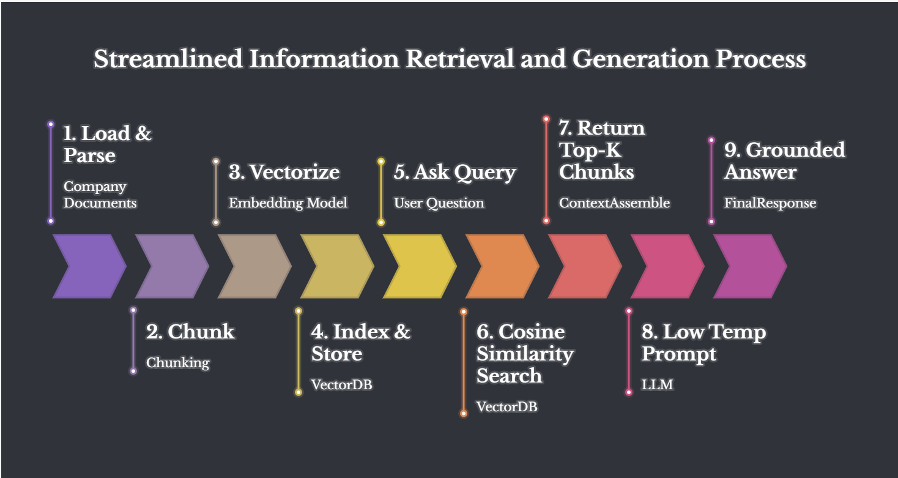

### 1. Document Ingestion & Chunking (`ingestion.py`)
* Raw text documents are loaded from the `/data` directory.
* The files are processed and parsed into small, semantic text chunks to fit within optimal context constraints.

### 2. Embedding Generation & Vector Storage (`indexing.py`)
* Text chunks are passed to Chroma DB.
* Underneath, the system leverages `sentence-transformers` to automatically generate dense vector embeddings for each chunk and index them for fast lookups.

### 3. Semantic Retrieval (`retrieval.py`)
* When a user submits a query, the system converts the query into an embedding.
* It performs a semantic search across the vector store to retrieve the **top 3 chunks** based on vector cosine similarity.

### 4. Grounded Context Generation (`main.py`)
* The top 3 retrieved chunks are injected directly into the LLM context window alongside the original user question.
* To completely eliminate hallucinations, the LLM is tightly constrained with a system prompt instructing it to rely *only* on the provided context, paired with a deterministic configuration (`temperature=0.0`). If the answer is not present in the context, the model explicitly outputs `"I don't know."`

